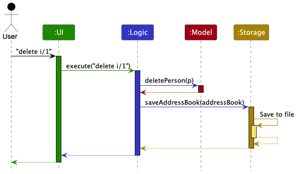
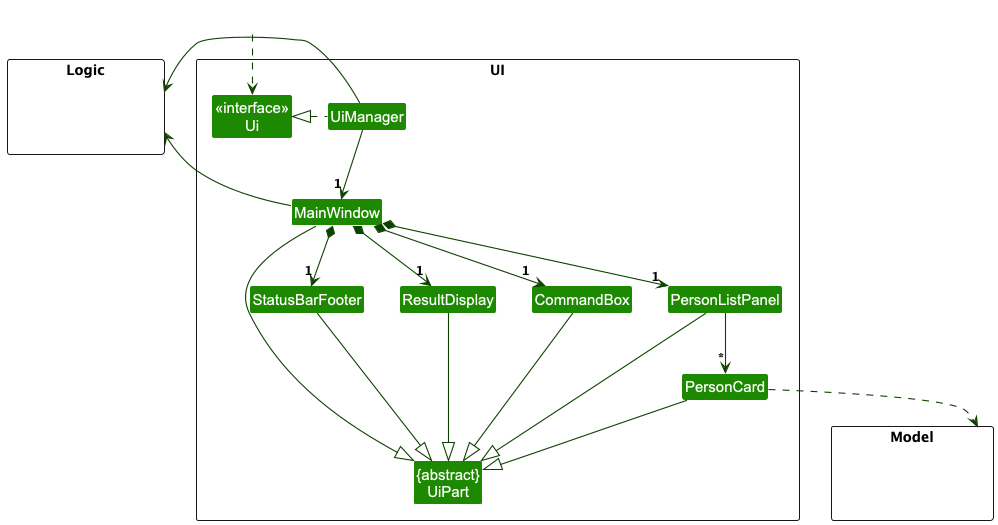
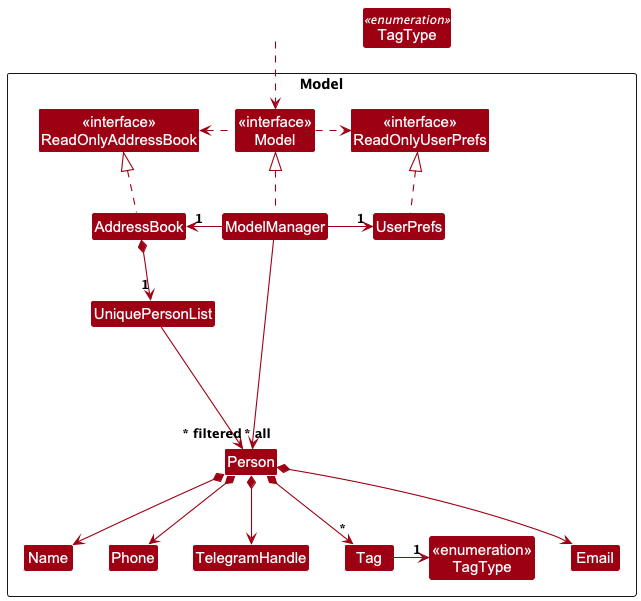
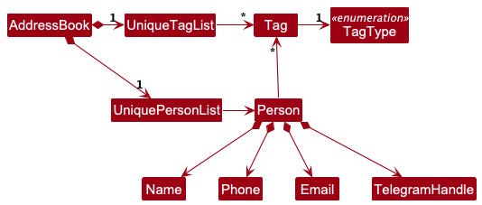
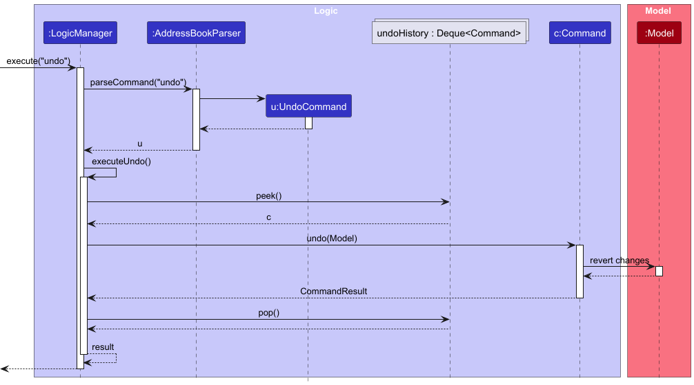
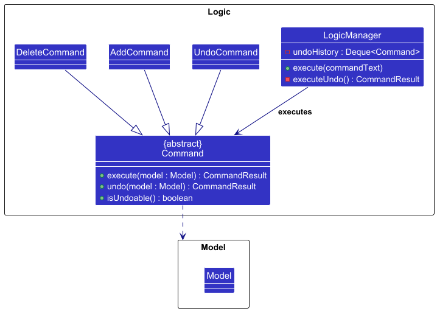
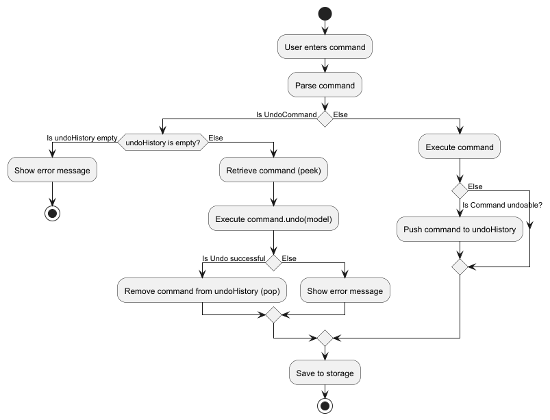

* Table of Contents
{:toc}

--------------------------------------------------------------------------------------------------------------------

## **Acknowledgements**

* Libraries used: [JavaFX](https://openjfx.io/), [Jackson](https://github.com/FasterXML/jackson), [JUnit5](https://github.com/junit-team/junit5)
* This project is based on the [AddressBook-Level3](https://se-education.org/addressbook-level3/) project created by the [SE-EDU initiative](https://se-education.org).


--------------------------------------------------------------------------------------------------------------------

## **Setting up, getting started**

Refer to the guide [_Setting up and getting started_](SettingUp.md).

--------------------------------------------------------------------------------------------------------------------

## **Design**

<div markdown="span" class="alert alert-primary">

:bulb: **Tip:** The `.puml` files used to create diagrams are in this document `docs/diagrams` folder. Refer to the [_PlantUML Tutorial_ at se-edu/guides](https://se-education.org/guides/tutorials/plantUml.html) to learn how to create and edit diagrams.
</div>

### Architecture


The ***Architecture Diagram*** given above explains the high-level design of the App.

Given below is a quick overview of main components and how they interact with each other.

**Main components of the architecture**

**`Main`** (consisting of classes [`Main`](https://github.com/AY2526S2-CS2103-F11-2/tp/tree/master/src/main/java/seedu/address/Main.java) and [`MainApp`](https://github.com/AY2526S2-CS2103-F11-2/tp/tree/master/src/main/java/seedu/address/MainApp.java)) is in charge of the app launch and shut down.
* At app launch, it initializes the other components in the correct sequence, and connects them up with each other.
* At shut down, it shuts down the other components and invokes cleanup methods where necessary.

The bulk of the app's work is done by the following four components:

* [**`UI`**](#ui-component): The UI of the App.
* [**`Logic`**](#logic-component): The command executor.
* [**`Model`**](#model-component): Holds the data of the App in memory.
* [**`Storage`**](#storage-component): Reads data from, and writes data to, the hard disk.

[**`Commons`**](#common-classes) represents a collection of classes used by multiple other components.

**How the architecture components interact with each other**

The *Sequence Diagram* below shows how the components interact with each other for the scenario where the user issues the command `delete i/1`.



Each of the four main components (also shown in the diagram above),

* defines its *API* in an `interface` with the same name as the Component.
* implements its functionality using a concrete `{Component Name}Manager` class (which follows the corresponding API `interface` mentioned in the previous point.

For example, the `Logic` component defines its API in the `Logic.java` interface and implements its functionality using the `LogicManager.java` class which follows the `Logic` interface. Other components interact with a given component through its interface rather than the concrete class (reason: to prevent outside component's being coupled to the implementation of a component), as illustrated in the (partial) class diagram below.


The sections below give more details of each component.

### UI component

The **API** of this component is specified in [`Ui.java`](https://github.com/AY2526S2-CS2103-F11-2/tp/tree/master/src/main/java/seedu/address/ui/Ui.java)



The UI consists of a `MainWindow` that is made up of parts e.g.`CommandBox`, `ResultDisplay`, `PersonListPanel`, `StatusBarFooter` etc. All these, including the `MainWindow`, inherit from the abstract `UiPart` class which captures the commonalities between classes that represent parts of the visible GUI.

The `UI` component uses the JavaFX UI framework. The layout of these UI parts are defined in matching `.fxml` files that are in the `src/main/resources/view` folder. For example, the layout of the [`MainWindow`](https://github.com/AY2526S2-CS2103-F11-2/tp/tree/master/src/main/java/seedu/address/ui/MainWindow.java) is specified in [`MainWindow.fxml`](https://github.com/AY2526S2-CS2103-F11-2/tp/tree/master/src/main/resources/view/MainWindow.fxml)

The `UI` component,

* executes user commands using the `Logic` component.
* listens for changes to `Model` data so that the UI can be updated with the modified data.
* keeps a reference to the `Logic` component, because the `UI` relies on the `Logic` to execute commands.
* depends on some classes in the `Model` component, as it displays `Person` object residing in the `Model`.

### Logic component

**API** : [`Logic.java`](https://github.com/AY2526S2-CS2103-F11-2/tp/tree/master/src/main/java/seedu/address/logic/Logic.java)

Here's a (partial) class diagram of the `Logic` component:


The sequence diagram below illustrates the interactions within the `Logic` component, taking `execute("delete i/1")` API call as an example.


<div markdown="span" class="alert alert-info">:information_source: **Note:** The lifeline for `DeleteCommandParser` should end at the destroy marker (X) but due to a limitation of PlantUML, the lifeline continues till the end of diagram.
</div>

How the `Logic` component works:

1. When `Logic` is called upon to execute a command, `LogicManager` passes the user input to `AddressBookParser`.
1. `AddressBookParser` identifies the command word and delegates to the corresponding parser (e.g., `DeleteCommandParser`) to construct a `Command` object.
1. `LogicManager` executes the command against the `Model`.
1. If the command is undoable (`command.isUndoable()`), `LogicManager` pushes it to an internal undo history stack.
1. If the command is `undo`, `LogicManager` handles it directly by invoking `undo(model)` on the most recent undoable command in that history stack. More details on the undo feature are provided in the [Undo feature](#undo-feature) section under Implementation.
1. After command execution, `LogicManager` persists changes through `Storage`, then returns a `CommandResult` to the caller.

Here are the other classes in `Logic` (omitted from the class diagram above) that are used for parsing a user command:


How the parsing works:
* `AddressBookParser` routes each command to an `XYZCommandParser` (`XYZ` is a placeholder for the specific command name, e.g., `AddCommandParser`) that validates input and creates an `XYZCommand` object.
* Commands with no parameters (`list`, `clear`, `exit`, `undo`) are validated directly in `AddressBookParser`; any extra arguments are rejected.
* Most command parsers use `ArgumentTokenizer` and `ParserUtil` helpers to enforce:
  * required/optional prefixes,
  * duplicate-prefix checks for single-valued fields,
  * detection of invalid or unexpected prefixes,
  * command-specific constraints (e.g., exactly one of `i/` or `e/` for `delete`).
* All `XYZCommandParser` classes implement the `Parser` interface so that they can be treated similarly where possible e.g, during testing.

### Model component
**API** : [`Model.java`](https://github.com/AY2526S2-CS2103-F11-2/tp/blob/master/src/main/java/seedu/address/model/Model.java)




The `Model` component,

* stores the address book data i.e., all `Person` objects (which are contained in a `UniquePersonList` object).
* A person is considered a duplicate if another person already has the same email, or the same Telegram handle ignoring case.
* stores the currently 'selected' `Person` objects (e.g., results of a search query) as a separate _filtered_ list which is exposed to outsiders as an unmodifiable `ObservableList<Person>` that can be 'observed' e.g. the UI can be bound to this list so that the UI automatically updates when the data in the list change.
* stores a `UserPref` object that represents the user’s preferences. This is exposed to the outside as a `ReadOnlyUserPref` object.
* does not depend on any of the other three components (as the `Model` represents data entities of the domain, they should make sense on their own without depending on other components)

<div markdown="span" class="alert alert-info">:information_source: **Note:** An alternative (arguably, a more OOP) model is given below. It has a `Tag` list in the `AddressBook`, which `Person` references. This allows `AddressBook` to only require one `Tag` object per unique tag, instead of each `Person` needing their own `Tag` objects.<br>



</div>


### Storage component

**API** : [`Storage.java`](https://github.com/AY2526S2-CS2103-F11-2/tp/tree/master/src/main/java/seedu/address/storage/Storage.java)


The `Storage` component,
* can save both address book data and user preference data in JSON format, and read them back into corresponding objects.
* inherits from both `AddressBookStorage` and `UserPrefsStorage`, which means it can be treated as either one (if only the functionality of only one is needed).
* depends on some classes in the `Model` component (because the `Storage` component's job is to save/retrieve objects that belong to the `Model`)

**Adapter pattern for JSON serialization**

The `Storage` component uses an adapter pattern to bridge between the domain model and JSON representation. Three adapter classes handle the conversion:

* `JsonSerializableAddressBook` — wraps the entire address book for serialization; its `toModelType()` method converts back to a `ReadOnlyAddressBook`, checking for duplicate persons in the process.
* `JsonAdaptedPerson` — represents a single `Person` in JSON form. The fields `phone` and `telegramHandle` are optional (nullable); `name` and `email` are required. `toModelType()` validates each field and throws `IllegalValueException` if any value is invalid.
* `JsonAdaptedTag` — represents a single `Tag`, storing both `tagName` and `tagType`.

**JSON data format**

Data is stored in two JSON files:

* `data/addressbook.json` — contact list:
  ```json
  {
    "addressbook": {
      "persons": [
        {
          "name": "Alex Yeoh",
          "phone": "87438807",
          "email": "alexyeoh@example.com",
          "telegramHandle": "alexyeoh",
          "tags": [{ "tagName": "cs2103t", "tagType": "COURSE" }]
        }
      ]
    }
  }
  ```
* `preferences.json` — GUI window size/position and the address book file path:
  ```json
  {
    "guiSettings": {
      "windowWidth": 740.0, 
      "windowHeight": 574.0, 
      "windowCoordinates": { 
        "x": 100, 
        "y": 100 
      } 
    },
    "addressBookFilePath": "data/addressbook.json"
  }
  ```

**Error handling on startup**

When CampusBridge starts, it attempts to read the address book file and handles three cases:
* **File not found** — sample data is loaded and the file is created on the next save or exit.
* **File is malformed or contains invalid data** — an empty address book is used and a warning is logged; the corrupted file is left untouched.
* **File is valid** — data is loaded normally.

### Common classes

Classes used by multiple components are in the `seedu.address.commons` package.

--------------------------------------------------------------------------------------------------------------------

## **Implementation**

This section describes some noteworthy details on how certain features are implemented.

### Add feature

#### Implementation

The `add` command is implemented using `AddCommandParser` and `AddCommand`.

When the user enters an `add` command, `AddressBookParser` delegates the input to `AddCommandParser`. `AddCommandParser` tokenizes the input using only the prefixes supported by `add`: `n/`, `e/`, `p/`, and `h/`.

The parser enforces the following rules:

* `n/NAME` and `e/EMAIL` are compulsory.
* `p/PHONE` and `h/TELEGRAM_HANDLE` are optional.
* Values are trimmed before validation.
* Repeated single-valued prefixes are rejected.
* Any non-empty preamble is rejected.
* Any unexpected slash-prefixed token is rejected as extra input. This includes prefixes from other commands such as `t/`, `tr/`, `tc/`, `tg/`, `i/`, `o/`, and `r/`, as well as unknown prefixes such as `x/`.
* `Name` validation allows only letters, numbers, spaces, and these symbols: `(` `)` `.` `-` `,` `'`.
* Other special characters are intentionally rejected. In particular, `/` is not supported because `/` is used by the CLI prefix-based syntax and may create parsing ambiguity. If a real-world name uses `/`, users should enter a supported substitute such as `-` instead (e.g. `D/O` as `D-O`).

After tokenization, `AddCommandParser` uses `ParserUtil` to validate and convert each supplied value into the corresponding model type. It then constructs a `Person` object and returns an `AddCommand`.

The sequence diagram below illustrates the interactions within the `Logic` component for a typical successful `add` command.


When `AddCommand` executes, it first checks for duplicate conflicts using `model.getDuplicateConflict(toAdd)`. If a duplicate email, duplicate Telegram handle, or both are detected, the command fails. Otherwise, the person is added to the model and a `CommandResult` is returned. If the added person's email is not an NUS-domain email, the success message also includes a warning.

`AddCommand` is undoable. Undoing an `add` removes the previously added person, unless that person no longer exists in the model.

#### Duplicate detection

Duplicate detection for `add` is based on `Person#isSamePerson(...)`.

Two persons are considered the same person if they have:

* the same email, or
* the same non-null Telegram handle.

This identity rule is used by `UniquePersonList` when adding and updating persons. As a result, the `add` command rejects contacts that duplicate either an existing email or an existing Telegram handle.

### Undo feature

#### Implementation

The undo feature is implemented using the Command pattern, where each undoable command encapsulates its own undo logic. The overall undo process is managed by `LogicManager`.

When an undoable command is executed, it is added to an internal stack (`undoHistory : Deque<Command>`) maintained by `LogicManager`.

When the `undo` command is invoked, `LogicManager` retrieves the most recent command from `undoHistory` using `peek()`. The `undo(Model)` method of that command is then executed to revert its effects. If the undo operation is successful, the command is removed from the stack using `pop()`.

This design ensures that each command is responsible for reversing its own changes, providing flexibility and adhering to the Command pattern.

The following sequence diagram illustrates how the undo operation is executed:



The following class diagram shows the simplified structure of the undo feature:



The following Activity diagram illustrates the control flow of command execution in the undo feature.



Note: Undo methods in commands directly interact with the `Model` to revert changes. Hence, we are not having an object diagram here. UI and Storage components are omitted from the diagrams as they are not directly involved in the undo mechanism.

#### Design Considerations

**Aspect: How undo executes:**

* **Alternative 1 :** Saves the entire address book.
  * Pros: Easy to implement.
  * Cons: May have performance issues in terms of memory usage.

* **Alternative 2 (current choice):** Individual command knows how to undo by
  itself.
  * Pros: Will use less memory (e.g. for `delete`, just save the person being deleted).
  * Cons: We must ensure that the implementation of each individual command are correct.

--------------------------------------------------------------------------------------------------------------------

## **Documentation, logging, testing, configuration, dev-ops**

* [Documentation guide](Documentation.md)
* [Testing guide](Testing.md)
* [Logging guide](Logging.md)
* [Configuration guide](Configuration.md)
* [DevOps guide](DevOps.md)

--------------------------------------------------------------------------------------------------------------------

## **Appendix: Requirements**

### Product scope

**Target user profile**:
NUS undergraduate students who
* Need to organize contact information of their Professors, Teaching Assistants and Groupmates.
* Values efficiency and prefers tools that save time and reduce friction.
* Prefer using CLI over GUI.

**Value proposition**:
CampusBridge helps NUS undergraduate students to organize and access contact information for their academic peers across different modules and faculties.

It does so by providing a centralized, easy-to-use system to save, search, and manage academic contacts efficiently.

### User stories

Priorities: High (must have) - `* * *`, Medium (nice to have) - `* *`, Low (unlikely to have) - `*`

#### Current version

| Priority | As a …​                    | I can …​                                                                 | So that I can…​                                                                   |
|----------|----------------------------|--------------------------------------------------------------------------|-----------------------------------------------------------------------------------|
| `* * *`  | user                       | add a contact                                                            | store and organize important academic contact information in one place            |
| `* * *`  | user                       | view all my contacts                                                     | quickly see everyone in one place                                                 |
| `* * *`  | user                       | delete a contact                                                         | keep my contact list accurate and organized                                       |
| `* * *`  | user                       | edit a specific contact                                                  | quickly correct mistakes in their contact information                             |
| `* * *`  | user                       | exit the application                                                     | safely close CampusBridge when I am done using it                                 |
| `* * *`  | user                       | have my contacts saved automatically                                     | prevent losing my data when the application closes                                |
| `* * *`  | user                       | validate my input                                                        | minimize incorrect information                                                    |
| `* * *`  | new user                   | see clear error messages                                                 | understand what went wrong and correct my input without feeling confused          |
| `* * *`  | regular user               | search contacts by name, email and tags                                  | quickly find someone                                                              |
| `* * *`  | new user                   | view help details                                                        | see specific examples and parameter requirements for that command                 |
| `* *`    | regular user               | sort contacts by name, email, or phone in ascending or descending order  | browse them more easily                                                           |
| `* *`    | new user                   | view preloaded sample modules and contacts                               | understand the app’s layout and value without adding real data                    |
| `* *`    | user                       | add new tags to an existing contact                                      | keep their information updated as the semester evolves                            |
| `* *`    | user                       | delete specific tags from a contact without deleting the entire contact  | keep my contact information accurate                                              |
| `* *`    | user                       | clear all tags from a contact                                            | reset the contact’s categorization without manually deleting every individual tag |
| `* *`    | expert user                | undo my last action                                                      | instantly revert an accidental deletion without stress                            |
| `* *`    | expert user                | have keyboard shortcuts                                                  | operate the system efficiently                                                    |
| `* *`    | expert user                | copy any contact field                                                   | efficiently transfer information to other applications without manual typing      |
| `* *`    | expert user                | view colour-coded tags                                                   | quickly identify and prioritize important information.                            |
| `* *`    | regular user               | navigate command history                                                 | execute or modify past commands without retyping them                             |

#### Near-future version

| Priority | As a …​                          | I can …​                                                           | So that I can…​                                                            |
|----------|----------------------------------|--------------------------------------------------------------------|----------------------------------------------------------------------------|
| `*`      | user                             | export contact data in a human-readable format like JSON           | can edit it easily                                                         |
| `*`      | regular user                     | mark a preferred contact method                                    | know the fastest way to reach someone                                      |
| `*`      | regular user                     | mark certain contacts as favorites                                 | keep my most important connections easily accessible at the top of my list | 
| `*`      | frequent user                    | add notes to contacts                                              | store useful contextual information                                        |
| `*`      | fast typing user                 | use short aliases for commands                                     | minimize keystrokes                                                        |
| `*`      | forgetful student                | see a list of "Available Now" contacts based on their office hours | know exactly who I want to visit for a walk-in consultation                |
| `*`      | regular user                     | create a personal profile                                          | tailor the application experience to my specific preferences and needs     |
| `*`      | user                             | view a list of command history                                     | recall what I just changed                                                 |
| `*`      | advanced user                    | bulk add contacts at once                                          | save time when entering many contacts                                      |
| `*`      | advanced user                    | bulk delete contacts at once                                       | remove outdated or unnecessary contacts efficiently                        |
| `*`      | advanced user                    | bulk edit contacts at once                                         | manage large contact groups with minimal effort                            |
| `*`      | user managing multiple semesters | toggle between “current semester” and “past semesters” views       | reference old contacts without cluttering my main screen                   |
| `*`      | user desiring full control       | customize the GUI theme                                            | personalize my experience                                                  |
| `*`      | regular user                     | create “sub-groups” for teammates within a module                  | manage project-specific communication efficiently                          |
| `*`      | frequent user                    | set custom reminders for prof/TA office hours                      | stay on top of opportunities for academic help                             |
| `*`      | new user                         | import my existing contacts                                        | avoid manually adding them                                                 |
| `*`      | user with many past contacts     | archive old semester contacts                                      | have my active list remain uncluttered and focused on current needs        |
| `*`      | user                             | add my current semester’s modules by searching NUS module codes    | categorize contacts accurately and save time                               |

See the full list on [GitHub](https://github.com/AY2526S2-CS2103-F11-2/tp/issues?q=is%3Aissue%20label%3Atype.Story)

### Use cases

(For all use cases below, the **System** is the `CampusBridge` and the **Actor** is the `user`, unless specified otherwise)

#### Use case: UC01 - Getting help

**Preconditions: Application is running**

**MSS:**
1. User requests for help.
2. CampusBridge displays the relevant section of the user guide.

Use case ends.

**Extension:**

* 1a. User provides an unrecognised command name.
  * 1a1. CampusBridge shows an error message indicating the command name does not exist and list all the valid commands.
  
  Use case ends.

* 1b. User provides more than one word.
  * 1b1. CampusBridge shows an error message indicating invalid command format.
  
  Use case ends.


#### Use case: UC02 - Add a contact

**Preconditions: Application is running**

**MSS:**
1. User requests to add a contact.
2. User provides the contact details.
3. CampusBridge adds the contact and updates the contact list.
4. CampusBridge shows a success message.

Use case ends.

**Extension:**
* 2a. User provides an invalid input.
  * 2a1. CampusBridge shows an error message indicating invalid command format.

  Use case ends.

* 2b. Email or Telegram handle already exists in the contact list.
  * 2b1. CampusBridge shows an error message indicating the contact already exists.

  Use case ends.


#### Use case: UC03 - Edit a contact

**Preconditions: Application is running and the user has added a contact.**

**MSS:**
1. User <ins>requests to list contacts (UC08)</ins>.
2. User requests to edit a contact in the list.
3. User provides new contact details for that contact.
4. CampusBridge edits the contact and updates the contact list.
5. CampusBridge shows a success message.

Use case ends.

**Extension:**
* 3a. User provides an invalid input.
  * 3a1. CampusBridge shows an error message indicating the invalid command format.

  Use case ends.

* 3b. Specified contact does not exist.
  * 3b1. CampusBridge shows an error message indicating the contact does not exist.

  Use case ends.

* 3c. Email or Telegram handle already exists in the contact list.
  * 3c1. CampusBridge shows an error message indicating the contact already exists.

  Use case ends.


#### Use case: UC04 - Delete a contact

**Preconditions: Application is running and the user has added a contact.**

**MSS:**
1. User <ins>requests to list contacts (UC08)</ins>.
2. User requests to delete a contact in the list.
3. CampusBridge deletes the contact and updates the contact list.
4. CampusBridge shows a success message.

Use case ends.

**Extensions:**
* 2a. User provides an invalid input.
  * 2a1. CampusBridge shows an error message indicating the invalid command format.

  Use case ends.

* 2b. Specified contact does not exist.
  * 2b1. CampusBridge shows an error message indicating the contact does not exist.

  Use case ends.


#### Use case: UC05 - Add tags to an existing contact

**Preconditions: Application is running and the user has added a contact.**

**MSS:**
1. User <ins>requests to list contacts (UC08)</ins>.
2. User requests to add tags to a contact in the list.
3. User provides tag details for that contact.
4. CampusBridge adds the tags and updates the contact list.
5. CampusBridge shows a success message.

Use case ends.

**Extensions:**
* 3a. User provides an invalid input.
  * 3a1. CampusBridge shows an error message indicating the invalid command format.

  Use case ends.

* 3b. Specified contact does not exist.
  * 3b1. CampusBridge shows an error message indicating the contact does not exist.

  Use case ends.

* 3c. All specified tags already exist on the contact.
  * 3c1. CampusBridge shows an error message indicating the contact already has these tags.

  Use case ends.

* 4a. Some (but not all) specified tags already exist on the contact.
  * 4a1. CampusBridge adds only new tags and updates the contact list.
  * 4a2. CampusBridge shows a success message indicating the new tags added and the tags skipped.

  Use case ends.


#### Use case: UC06 - Remove tags from a contact

**Preconditions: Application is running**

**MSS:**
1. User <ins>requests to list contacts (UC08)</ins>.
2. User requests to remove one or more tags from a contact.
3. CampusBridge removes the specified tags and displays the updated contact.

Use case ends.

**Extensions:**
* 2a. User provides an invalid input.
  * 2a1. CampusBridge shows an error message indicating the invalid command format.

  Use case ends.

* 2b. Specified contact does not exist.
  * 2b1. CampusBridge shows an error message indicating the contact does not exist.

  Use case ends.

* 2c. None of the specified tags exist on the contact.
  * 2c1. CampusBridge shows an error indicating none of the tags were found.

  Use case ends.

* 3a. Some (but not all) specified tags exist on the contact.
  * 3a1. CampusBridge removes the existing tags and displays the updated contact.
  * 3a2. CampusBridge informs the user which tags were not found.

  Use case ends.


#### Use case: UC07 - Clearing all tags of a type from a contact

**Preconditions: Application is running**

**MSS:**
1. User <ins>requests to list contacts (UC08)</ins>.
2. User requests to clear tags of a specific type.
3. CampusBridge clears all the tags of the specific type and updates the contact list.
4. CampusBridge shows a success message.

Use case ends.

**Extensions:**
* 2a. User provides an invalid input.
  * 2a1. CampusBridge shows an error message indicating the invalid command format.

  Use case ends.

* 2b. Specified contact does not exist.
  * 2b1. CampusBridge shows an error message indicating the contact does not exist.

  Use case ends.

* 2c. No tags of specified type exist.
  * 2c1. CampusBridge shows an error indicating no tags found to clear.

  Use case ends.


#### Use case: UC08 - Listing all contacts

**Preconditions: Application is running**

**MSS:**
1. User requests to list all contacts.
2. CampusBridge shows a list of all contacts.

Use case ends.

**Extensions:**
* 1a. User provides extra arguments.
  * 1a1. CampusBridge shows an error message indicating the invalid command format.

  Use case ends.


#### Use case: UC09 - Sorting contacts

**Preconditions: Application is running**

**MSS:**
1. User requests to sort contacts.
2. User provides sort field (name/email/phone/reset) and optional reverse order.
3. CampusBridge sorts the contacts based on the specified criteria.
4. CampusBridge displays the list of contacts in the specified sorted order.

Use case ends.

**Extensions:**
* 2a. User provides an invalid input.
  * 2a1. CampusBridge shows an error message indicating the invalid command format.

  Use case ends.


#### Use case: UC10 - Search contacts

**Preconditions: Application is running**

**MSS:**
1. User requests to search for contacts.
2. User provides the search details.
3. CampusBridge shows the contacts matching the search query.

Use case ends.

**Extensions:**
* 2a. User provides an invalid input.
    * 2a1. CampusBridge shows an error message indicating the invalid command format.

  Use case ends.

* 3a. No contacts exist in the list.
  * 3a1. CampusBridge informs the user that no contacts match the search query.

  Use case ends.


#### Use case: UC11 - Undo previous action

**Preconditions: Application is running**

**MSS:**
1. User requests to undo the most recent action.
2. CampusBridge restores the data to its previous state.
3. CampusBridge shows the updated state and a success message.

Use case ends.

**Extensions:**
* 1a. No undoable commands available in undo history.
  * 1a1. CampusBridge shows an error message indicating that there are no actions to undo.

  Use case ends.


#### Use case: UC12 - Navigating command history

**Preconditions: Application is running**

**MSS:**
1. User requests to navigate to an earlier command.
2. CampusBridge displays the earlier command.
   Steps 1-2 are repeated until the user is satisfied.

Use case ends.

**Extensions:**
* 1a. No command history exists.
  * 1a1. CampusBridge does nothing.

  Use case ends.

* 2a. User requests to navigate to a more recent command.
  * 2a1. CampusBridge displays the more recent command.

  Use case resumes at step 1.

* 2b. No earlier command exists.
  * 2b1. CampusBridge does nothing.

  Use case resumes at step 1.

* 2c. No more recent command exists.
  * 2c1. CampusBridge does nothing.

  Use case resumes at step 1.


#### Use case: UC13 - Clearing all contacts

**Preconditions: Application is running**

**MSS:**
1. User requests to clear all contacts.
2. CampusBridge clears all contacts.

Use case ends.

**Extensions:**
* 1a. User provides extra arguments.
  * 1a1. CampusBridge shows an error message indicating the invalid command format.

  Use case ends.


#### Use case: UC14 - Exiting

**Preconditions: Application is running**

**MSS:**
1. User requests to exit the app.
2. CampusBridge terminates.

Use case ends.

**Extensions:**
* 1a. User provides extra arguments.
  * 1a1. CampusBridge shows an error message indicating the invalid command format.

  Use case ends.


### Non-Functional Requirements

1. Should work on any _mainstream OS_ as long as it has Java `17` or above installed.
2. Should be able to hold up to 1000 persons without a noticeable sluggishness in performance for typical usage.
3. A user with above average typing speed for regular English text (i.e. not code, not system admin commands) should be able to accomplish most of the tasks faster using commands than using the mouse.
4. Changes should be implemented incrementally, i.e. in a way that allows the app to be usable after each increment, even if some features are not yet implemented.
5. All logics and storage should be implemented locally, to ensure testability and usability in secure environments without internet access.
6. The distributed JAR file should not be bloated, preferably less than 10MB, to ensure that it can be easily downloaded and stored on devices with limited storage.

### Glossary

* Brownfield project: A software project developed upon an existing codebase, rather than starting from scratch.
* CLI (Command-line interface): A text-based user interface where users type specific commands to interact with the application or OS.
* Command: A text instruction entered by the user (e.g. `add`, `delete`, `edit`) that triggers a specific action in the application.
* Course: An academic course offered at NUS, identified by a unique course code (e.g. CS2103T, CS2101).
* Course tag: A type of tag (displayed in blue) used to label a contact with an NUS course code. Its prefix is `tc/`.
* Duplicate person: A contact is considered a duplicate if another contact already has the same email OR the same non-empty Telegram handle (case-insensitive for handles).
* Fuzzy matching: A search technique used in the `find` command that allows for minor typos or substrings rather than requiring an exact character-for-character match.
* General tag: A type of tag (displayed in red) for any user-defined label. Its prefix is `tg/`.
* Groupmate: A fellow student who collaborates with you on academic projects, assignments, or study groups within the same module.
* GUI (Graphical user interface): A visual way for users to interact with digital components through items like icons and buttons.
* Index: A positive integer representing the position of a contact in the currently displayed list.
* Mainstream OS: Windows, Linux, Unix, MacOS.
* NUS domain: Email addresses ending with `@u.nus.edu` (student), `@nus.edu.sg` (staff), or `@*.nus.edu.sg`.
* Prefix: A short identifier (e.g. `n/`, `e/`, `tg/`) used in commands to denote the type of parameter that follows.
* Professor: An academic staff member who teaches a course at NUS.
* Role tag: A type of tag (displayed in green) used to label a contact's academic role. Its prefix is `tr/`.
* Tag: A label attached to a contact for categorization.
* Teaching Assistant (TA): A graduate or undergraduate student who assists with teaching duties, including conducting tutorials and grading assignments.
* Undoable command: A command (e.g. `add`, `delete`, `edit`, `tag`) that can be reversed using the `undo` command. Commands like `list` and `find` are not undoable.
* Undo history stack: An internal data structure that stores previous commands, allowing the user to revert changes in reverse chronological order.

--------------------------------------------------------------------------------------------------------------------

## **Appendix: Instructions for manual testing**

Given below are instructions to test the app manually.

<div markdown="span" class="alert alert-info">:information_source: **Note:** These instructions only provide a starting point for testers to work on;
testers are expected to do more *exploratory* testing.

</div>

### Launch and shutdown

1. Initial launch

   1. Download the jar file and copy into an empty folder

   1. Double-click the jar file Expected: Shows the GUI with a set of sample contacts. The window size may not be optimum.

1. Saving window preferences

   1. Resize the window to an optimum size. Move the window to a different location. Close the window.

   1. Re-launch the app by running `java -jar CampusBridge-v1.6.jar` in the terminal.<br>

      Expected: The most recent window size and location is retained.

1. Shutting down

   1. Test case: `exit`<br>
      Expected: The application closes.

   1. Alternative: Press `F3` (or `Fn + F3` on Mac).<br>
      Expected: Same as above.

   1. Test case: `exit 123`<br>
      Expected: Application does not close. Error details shown indicating command does not take in any parameter.


### Viewing help

1. Opening general help

    1. Test case: `help`<br>
       Expected: The User Guide opens in the system default browser. Status message shows `Opened user guide in browser.`

   1. Alternative: Press `F1` (or `Fn + F1` on Mac).<br>
      Expected: Same as above.

1. Opening command-specific help

    1. Test case: `help add`<br>
       Expected: The User Guide opens in the system default browser at the `add` command section. Status message shows `Opening user guide for 'add' command.`

    1. Other valid command names to try: `help list`, `help edit`, `help delete`, `help find`, `help sort`, `help tag`, `help untag`, `help cleartag`, `help clear`, `help exit`<br>
       Expected: The User Guide opens at the respective command section. Status message names the command.

1. Invalid help arguments

    1. Test case: `help INVALID`<br>
       Expected: The User Guide does not open. Error details shown in the status message.

    1. Test case: `help ADD` (uppercase)<br>
       Expected: Same as above. Command names are case-sensitive and must be lowercase.

    1. Test case: `help add extra`<br>
       Expected: Same as above. Only a single command name is accepted; extra words cause a format error.

### Adding a person

1. Adding a person with all fields

    1. Prerequisites: Start with the sample data loaded. Ensure the email and Telegram handle used below do not already exist.

    1. Test case: `add n/John Doe e/johndoe@example.com p/91234567 h/john_doe`<br>
       Expected: A new contact is added to the list. The success message shows the added person's details.

2. Adding a person with only compulsory fields

    1. Prerequisites: Ensure the email used below does not already exist.

    1. Test case: `add n/Jane Doe e/janedoe@example.com`<br>
       Expected: A new contact is added without phone number and Telegram handle. The success message shows the added person's details.

3. Adding a person with a non-NUS email

    1. Prerequisites: Ensure the email used below does not already exist.

    1. Test case: `add n/Alex Tan e/alextan@gmail.com`<br>
       Expected: A new contact is added. A warning is shown indicating that the email is not an NUS domain.

4. Adding a person with duplicate email or Telegram handle

    1. Prerequisites: Add a contact using `add n/Test Person e/testperson@example.com h/test_person`.

    1. Test case: `add n/Another Person e/testperson@example.com`<br>
       Expected: No person is added. Error details shown in the status message indicating that a person with this email already exists.

    1. Test case: `add n/Another Person e/anotherperson@example.com h/test_person`<br>
       Expected: No person is added. Error details shown in the status message indicating that a person with this Telegram handle already exists.

    1. Test case: `add n/Case Person e/caseperson@example.com h/TEST_PERSON`<br>
       Expected: No person is added. Error details shown in the status message indicating that a person with this Telegram handle already exists.

    1. Test case: `add n/Another Person e/testperson@example.com h/test_person`<br>
       Expected: No person is added. Error details shown in the status message indicating that a person with this email and Telegram handle already exists.

5. Invalid add commands

    1. Test case: `add n/John Doe`<br>
       Expected: No person is added. Error details shown in the status message.

    1. Test case: `add e/johndoe@example.com`<br>
       Expected: No person is added. Error details shown in the status message.

    1. Test case: `add n/John Doe e/invalid-email`<br>
       Expected: No person is added. Error details shown in the status message.

    1. Test case: `add n/John Doe n/Jane Doe e/johndoe@example.com`<br>
       Expected: No person is added. Error details shown in the status message indicating duplicate prefixes.

    1. Test case: `add n/John Doe e/johndoe@example.com tg/friend`<br>
       Expected: No person is added. Error details shown in the status message indicating unexpected extra input.

### Editing a person

1. Editing a person with all fields
    1. Prerequisites: Start with the sample data loaded. Ensure the email and Telegram handle used below do not already exist. At least one person in the list.

    1. Test case: `edit 1 n/John Lim e/johnlim@nus.edu.sg p/81234567 h/john_LIM`<br>
       Expected: The first contact is updated with the new details. The success message shows the edited person's details.

2. Editing a person with one field
    1. Prerequisites: Start with the sample data loaded. Ensure the email and Telegram handle used below do not already exist. At least one person in the list.

    1. Test case: `edit 1 n/John Lim`<br>
       Expected: The first contact's name is updated. All other fields remain unchanged. The success message shows the edited person's details.

   1. Test case: `edit 1 e/johnlim@u.nus.edu`<br>
      Expected: The first contact's email is updated. All other fields remain unchanged. The success message shows the edited person's details.

   1. Test case: `edit 1 p/12345678`<br>
      Expected: The first contact's phone number is updated. All other fields remain unchanged. The success message shows the edited person's details.

   1. Test case: `edit 1 h/johnlimm`<br>
      Expected: The first contact's telegram handle is updated. All other fields remain unchanged. The success message shows the edited person's details.

3. Editing a person with a non-NUS email
    1. Prerequisites: Start with the sample data loaded. Ensure the email used below do not already exist. At least one person in the list.

    1. Test case: `edit 1 e/john@gmail.com`<br>
       Expected: The first contact's email is updated. A warning is shown indicating that the email is not an NUS domain.

4. Editing a person with duplicate email or Telegram handle
    1. Prerequisites: Start with the sample data loaded. The first contact has email `johnlim@u.nus.edu` and Telegram handle `johnlimm`. At least two person in the list.

    1. Test case: `edit 2 e/johnlim@u.nus.edu`<br>
       Expected: No changes made. Error details shown indicating a person with this email already exists.

    1. Test case: `edit 2 h/johnlimm`<br>
       Expected: No changes made. Error details shown indicating a person with this Telegram handle already exists.

5. Invalid edit commands
    1. Test case: `edit`<br>
       Expected: No changes made. Invalid command format error shown.

    1. Test case: `edit 1`<br>
       Expected: No changes made. Invalid command format error shown.

    1. Test case: `edit 0 n/John Lim`<br>
       Expected: No changes made. Error details shown indicating the index should be a positive integer.

    1. Test case: `edit 999 n/John Lim` (where 999 is larger than list size) <br>
       Expected: No changes made. Error details shown in the status message indicating no person exists at that index and tip to use `list` command.

    1. Test case: `edit 1 n/John Lim n/Jane Lim`<br>
       Expected: No changes made. Error details shown indicating duplicate prefixes.

    1. Test case: `edit 1 n/John Lim tg/friend`<br>
       Expected: No changes made. Error details shown indicating unexpected extra input.

### Deleting a person

1. Deleting a person by index

   1. Prerequisites: List all persons using the `list` command. Multiple persons in the list.

   1. Test case: `delete i/1`<br>
      Expected: First contact is deleted from the list. Details of the deleted contact shown in the status message.

1. Deleting a person by email

   1. Prerequisites: List all persons using the `list` command. Ensure a person with email `alicetan@u.nus.edu` exists in the list.

   1. Test case: `delete e/alicetan@u.nus.edu`<br>
      Expected: Person with the specified email is deleted from the list. Details of the deleted contact shown in the status message.

1. Invalid delete commands

   1. Test case: `delete`<br>
      Expected: No person deleted. Error details shown in the status message indicating invalid command format and command usage.

   1. Test case: `delete i/0`<br>
      Expected: No person deleted. Error details shown in the status message indicating index must be a positive integer (1, 2, 3...).

   1. Test case: `delete e/invalid-email`<br>
      Expected: No person deleted. Error details shown in the status message indicating email constraints.

   1. Test case: `delete 1` (missing prefix)<br>
       Expected: No person deleted. Error details shown in the status message indicating invalid command format and command usage.

   1. Test case: `delete i/1 i/2`(multiple same prefixes)<br>
      Expected: No person deleted. Error details shown in the status message indicating multiple values specified for the following single-valued field(s): `i/`.

   1. Test case: `delete e/alicetan@u.nus.edu i/1` (both prefixes)<br>
      Expected: No person deleted. Error details shown in the status message indicating invalid command format and command usage.

   1. Test case: `delete i/1 n/alice p/12345678` (multiple invalid prefixes)<br>
      Expected: No person deleted. Error details shown in the status message invalid command format and unexpected extra input.

   1. Test case: `delete i/100` (where 100 is larger than list size)<br>
      Expected: No person deleted. Error details shown in the status message indicating no person exists at that index and tip to use `list` command.

   1. Test case: `delete e/nonexistent@example.com`<br>
      Expected: No person deleted. Error details shown in the status message indicating no person found with that email and tip to use `list` or `find` commands.

### Tagging a person

1. Adding tags to a person

   1. Prerequisites: List all persons using the `list` command. Multiple persons in the list. Ensure the first and second person has no existing tags.

   1. Test case: `tag 1 tg/friends`<br>
      Expected: `friends` general tag is added to the 1st person in the list. Status message shows the details of the new tags added.

   1. Test case: `tag 2 tg/groupmates tc/cs2103`<br>
      Expected: Both `groupmates` general tag and `cs2103` course tag are added to the 2nd person in the list. Status message shows the details of the new tags added.

   1. Test case: `tag 2 tr/tutor tr/TUTOR` (duplicate with different case)<br>
      Expected: Only one `tutor` role tag is added to the 2nd person in the list. Status message shows the details of the new tags added.

   1. Test case: `tag 2 tr/mentor tg/mentor` (same name, different types)<br>
      Expected: Both `mentor` role tag and `mentor` general tag are added to the 2nd person in the list. Status message shows the details of the new tags added.

1. Adding tags to a person where some tags already exist

   1. Prerequisites: List all persons using the `list` command. Multiple persons in the list. Ensure the first person only have existing `friends` general tag and `cs2103` course tag.

   1. Test case: `tag 1 tg/friends tg/groupmates` (where `friends` already exists)<br>
      Expected: Only `groupmates` general tag is added to the 1st person in the list. Status message shows:
      ```
      New tags added: [GENERAL: groupmates]
      Tags already existing (no changes made): [GENERAL: friends]
      ```

   1. Test case: `tag 1 tc/cs2109s tc/cs2100 tc/cs2103` (where `cs2103` already exists)<br>
      Expected: `cs2109s` and `cs2100` course tags are added to the 1st person in the list. Status message shows:
      ```
      New tags added: [COURSE: cs2109s, COURSE: cs2100]
      Tags already existing (no changes made): [COURSE: cs2103]
      ```

1. Adding tags to a person where all tags already exist

   1. Prerequisites: List all persons using the `list` command. Multiple persons in the list. Ensure the first person have existing `friends` general tag and `cs2103` course tag.

   1. Test case: `tag 1 tg/friends` (where `friends` already exists)<br>
      Expected: No changes made. Error details shown in the status message indicating that all tags already exist for this person and no changes made.

   1. Test case: `tag 1 tg/friends tc/cs2103` (where both tags already exists)<br>
      Expected: No changes made. Error details shown in the status message indicating that all tags already exist for this person and no changes made.

1. Invalid tag commands

   1. Test case: `tag`<br>
      Expected: No tag added. Error details shown in the status message indicating invalid command format and command usage.

   1. Test case: `tag 0`<br>
      Expected: No tag added. Error details shown in the status message indicating index must be a positive integer (1, 2, 3...).

   1. Test case: `tag 1 test` (missing prefix)<br>
      Expected: No tag added. Error details shown in the status message indicating invalid command format and command usage.

   1. Test case: `tag 1 n/alice` (invalid prefixes)<br>
      Expected: No tag added. Error details shown in the status message indicating invalid command format and unexpected extra input.

   1. Test case: `tag 1 tr/` (missing value)<br>
      Expected: No tag added. Error details shown in the status message indicating invalid command format and empty value provided for prefix.

   1. Test case: `tag 100 tg/friends` (where 100 is larger than list size)<br>
      Expected: No tag added. Error details shown in the status message indicating no person exists at that index and tip to use `list` command.

   1. Test case: `tag 1 tr/tutor space`<br>
      Expected: No tag added. Error details shown in the status message indicating tags names should be alphanumeric only (no spaces or special characters).

### Untagging a person

1. Removing tags from a person

   1. Prerequisites: List all persons using the `list` command. Multiple persons in the list. Ensure the first person have existing `tutor` role tag, `cs2103` course tag, `friends` and `groupmates` general tags.

   1. Test case: `untag 1 tg/friends`<br>
      Expected: `friends` general tag is removed from the 1st person in the list. Status message shows the details of the tags removed.

   1. Test case: `untag 1 tg/groupmates tc/cs2103`<br>
      Expected: Both `groupmates` general tag and `cs2103` course tag are removed from the 1st person in the list. Status message shows the details of the tags removed.

   1. Test case: `untag 1 tr/tutor tr/TUTOR` (duplicate with different case)<br>
      Expected: Only one `tutor` role tag is removed from the 1st person in the list. Status message shows the details of the tags removed.

1. Removing tags from a person where some tags don't exist

   1. Prerequisites: List all persons using the `list` command. Multiple persons in the list. Ensure the first person only have existing `cs2103` course tag and `friends` general tags.

   1. Test case: `untag 1 tg/friends tr/tutor` (where `friends` exists but `tutor` doesn't)<br>
      Expected: Only `friends` general tag is removed from the 1st person in the list. Status message shows:
      ```
      Tags removed: [GENERAL: friends]
      Tags not found: [ROLE: tutor]
      ```

   1. Test case: `untag 1 tc/cs2109s tc/cs2100 tc/cs2103` (where `cs2103` exists but `cs2109s` and `cs2100` doesn't)<br>
      Expected: Only `cs2103` course tag is removed from the 1st person in the list. Status message shows:
      ```
      Tags removed: [COURSE: cs2103]
      Tags not found: [COURSE: cs2109s, COURSE: cs2100]
      ```

1. Removing tags from a person where all tags don't exist

   1. Prerequisites: List all persons using the `list` command. Multiple persons in the list. Ensure the first person has no existing tags.

   1. Test case: `untag 1 tg/nonexistent` <br>
      Expected: No changes made. Error details shown in the status message indicating that none of the specified tags were found.

   1. Test case: `untag 1 tr/notfound tg/missing`<br>
      Expected: No changes made. Error details shown in the status message indicating that none of the specified tags were found.

1. Invalid untag commands

   1. Test case: `untag`<br>
      Expected: No tag removed. Error details shown in the status message indicating invalid command format and command usage.

   1. Test case: `untag 0`<br>
      Expected: No tag removed. Error details shown in the status message indicating index must be a positive integer (1, 2, 3...).

   1. Test case: `untag 1 test` (missing prefix)<br>
      Expected: No tag removed. Error details shown in the status message indicating invalid command format and command usage.

   1. Test case: `untag 1 n/alice` (invalid prefixes)<br>
      Expected: No tag removed. Error details shown in the status message indicating invalid command format and unexpected extra input.

   1. Test case: `untag 1 tr/` (missing value)<br>
      Expected: No tag removed. Error details shown in the status message indicating invalid command format and empty value provided for prefix.

   1. Test case: `untag 100 tg/friends` (where 100 is larger than list size)<br>
      Expected: No tag removed. Error details shown in the status message indicating no person exists at that index and tip to use `list` command.

   1. Test case: `untag 1 tr/tutor space`<br>
      Expected: No tag removed. Error details shown in the status message indicating tags names should be alphanumeric (no spaces or special characters).

### Clearing all tags of a specific type

1. Clearing all tags from a person

   1. Prerequisites: List all persons using the `list` command. Multiple persons in the list. Ensure both first and second person have existing general and role tags.

   1. Test case: `cleartag 1 tg/`<br>
      Expected: All the general tags are cleared from the 1st person in the list. Status message shows the details of the general tags cleared.

   1. Test case: `cleartag 2 tr/`<br>
      Expected: All the role tags are cleared from the 2nd person in the list. Status message shows the details of the role tags cleared.

1. Clearing all tags from a person where no tags of specified type exist

   1. Prerequisites: List all persons using the `list` command. Multiple persons in the list. Ensure both first and second person has no existing tags.

   1. Test case: `cleartag 1 tc/` <br>
      Expected: No changes made. Error details shown in the status message indicating that no course tags found to clear.

   1. Test case: `cleartag 2 tr/`<br>
      Expected: No changes made. Error details shown in the status message indicating that no role tags found to clear.

1. Invalid cleartag commands

   1. Test case: `cleartag`<br>
      Expected: No tag cleared. Error details shown in the status message indicating invalid command format and command usage.

   1. Test case: `cleartag 0`<br>
      Expected: No tag cleared. Error details shown in the status message indicating index must be a positive integer (1, 2, 3...).

   1. Test case: `cleartag 1` (missing prefix)<br>
      Expected: No tag cleared. Error details shown in the status message indicating invalid command format and command usage.

   1. Test case: `cleartag 1 n/alice` (invalid prefixes)<br>
      Expected: No tag cleared. Error details shown in the status message indicating invalid command format and unexpected extra input.

   1. Test case: `cleartag 1 tr/ tr/` (multiple same prefixes)<br>
      Expected: No tag cleared. Error details shown in the status message indicating multiple values specified for the following single-valued field(s): `tr/`.

   1. Test case: `cleartag 1 tr/ tg/` (multiple prefixes)<br>
      Expected: No tag cleared. Error details shown in the status message indicating invalid command format and command usage.

   1. Test case: `cleartag 100 tg/` (where 100 is larger than list size)<br>
      Expected: No tag cleared. Error details shown in the status message indicating no person exists at that index and tip to use `list` command.

   1. Test case: `cleartag 1 tr/tutor`<br>
      Expected: No tag cleared. Error details shown in the status message indicating invalid command format and prefix should not contain any value.

### Sorting persons

1. Sorting by a valid field

   1. Prerequisites: List all persons using the `list` command. Multiple persons in the list.

   1. Test case: `sort o/name`<br>
      Expected: Contact list is sorted alphabetically by name (ascending). Status message shows `Sorted by name (ascending).`

   1. Test case: `sort o/name r/`<br>
      Expected: Contact list is sorted alphabetically by name (descending). Status message shows `Sorted by name (descending).`

   1. Test case: `sort o/email`<br>
      Expected: Contact list is sorted by email address (ascending). Status message shows `Sorted by email (ascending).`

   1. Test case: `sort o/phone`<br>
      Expected: Contact list is sorted by phone number (ascending). Contacts with no phone number appear at the end of the list. Status message shows `Sorted by phone (ascending).`

   1. Test case: `sort o/email r/`<br>
      Expected: Contact list is sorted by email address (descending). Status message shows `Sorted by email (descending).`

1. Resetting sort order

   1. Test case: `sort o/none`<br>
      Expected: Contact list reverts to the default (insertion) order. Status message shows `Sort order reset to default.`

   1. Test case: `sort o/none r/`<br>
      Expected: Sort order is not reset. Error details shown in the status message indicating that `r/` cannot be used with `o/none`.

1. Invalid sort commands

   1. Test case: `sort`<br>
      Expected: List is not sorted. Error details shown in the status message.

   1. Test case: `sort o/INVALID`<br>
      Expected: List is not sorted. Error details shown in the status message indicating the unsupported order value.

   1. Test case: `sort o/NAME` (uppercase)<br>
      Expected: List is sorted by name. Order values are case-insensitive.

   1. Test case: `sort o/name r/value`<br>
      Expected: List is not sorted. Error details shown in the status message indicating that `r/` does not accept a value.

   1. Test case: `sort o/name o/email`<br>
      Expected: List is not sorted. Error details shown in the status message indicating duplicate `o/` prefix.

### Locating persons by name/email/tag
1. Searching by single field

    1. Prerequisites: List all persons using the `list` command. At least one person should be in the list.

    1. Test case: `find n/Alex`<br>
       Expected: Contacts whose names match `Alex` (case-insensitive; supports substring and fuzzy matching) are shown.

    1. Test case: `find e/nus.edu`<br>
       Expected: Contacts with email addresses containing `nus.edu` (case-insensitive substring) are shown.

    1. Test case: `find t/friends`<br>
       Expected: Contacts with the tag `friends` (case-insensitive exact match) are shown.

1. Searching by multiple keywords/fields

    1. Prerequisites: List all persons using the `list` command. At least two persons should be in the list.

    1. Test case: `find n/Alex David`<br>
       Expected: Contacts whose names match `Alex` **OR** `David` are shown (i.e. matches at least one keyword).

    1. Test case: `find n/Alex e/nus.edu`<br>
       Expected: Contacts whose names match `Alex` **AND** whose email contains `nus.edu` are shown.

    1. Test case: `find n/Alex e/nus.edu t/friends`<br>
       Expected: Contacts matching all three criteria (Name **AND** Email **AND** Tag) are shown.

1. Fuzzy search for names (slight typo tolerance)

    1. Prerequisites: A contact with name `Alice Tan` exists.

    1. Test case: `find n/alce`<br>
       Expected: `Alice Tan` is shown in the results.

    1. Test case: `find n/aliec`<br>
       Expected: `Alice Tan` is shown in the results.

    1. Test case: `find n/Tan`<br>
       Expected: `Alice Tan` is shown in the results.

1. Invalid search commands

    1. Test case: `find` (no parameters)<br>
       Expected: Error message indicating invalid command format and showing usage.

    1. Test case: `find n/`<br>
       Expected: Error message indicating empty value provided for prefix `n/`.

    1. Test case: `find n/!@#`<br>
       Expected: Error message indicating that the keyword `!@#` contains only special characters and must contain at least one alphanumeric character.

    1. Test case: `find p/91234567` (unsupported prefix for find)<br>
       Expected: Error message indicating unexpected extra input `p/91234567`.

### Undoing the last action

1. Undoing the most recent undoable command

    1. Prerequisites: List all persons using the `list` command. At least one person exists in the list.

    1. Test case: `add n/John Doe e/johndoe@example.com` followed by `undo`<br>
       Expected: The previously added contact is removed from the list. Status message indicates that the last add action has been undone.

    1. Test case: `delete i/1` followed by `undo`<br>
       Expected: The deleted contact is restored to the list. Status message indicates that the last delete action has been undone.

2. Undoing multiple commands consecutively

    1. Prerequisites: List all persons using the `list` command. Multiple persons in the list.

    1. Test case: Execute `add n/A e/a@example.com`, then `add n/B e/b@example.com`, then `undo`, then `undo`<br>
       Expected: Both added contacts are removed one by one in reverse order. Status message reflects each undo operation.

3. Undo when no undoable commands are available

    1. Prerequisites: Start the application fresh, or ensure all previous undoable commands have already been undone.

    1. Test case: `undo`<br>
       Expected: No changes to the contact list. Error details shown in the status message indicating that there are no actions to undo.

4. Undo after non-undoable commands

    1. Prerequisites: List all persons using the `list` command.

    1. Test case: `add n/John Doe e/johndoe@example.com`, then `list`, then `undo`<br>
       Expected: The previously added contact is removed. The `list` command does not affect undo history.

    1. Test case: `help`, then `undo`<br>
       Expected: No changes to the contact list. Error details shown in the status message if there are no undoable commands.

5. Undo after a mix of commands

    1. Prerequisites: List all persons using the `list` command. Multiple persons in the list.

    1. Test case: `add n/A e/a@example.com`, `list`, `delete i/1`, then `undo`<br>
       Expected: The deleted contact is restored. The `list` command is ignored by undo.
   
6. Persistence after undo

    1. Prerequisites: List all persons using the `list` command.

    1. Test case: `add n/John Doe e/johndoe@example.com`, then `undo`, then restart the application<br>
       Expected: The contact list reflects the undone state (i.e., the added contact does not appear).

7. Invalid undo command

    1. Test case: `undo extra`<br>
       Expected: No changes to the contact list. Error details shown in the status message indicating that the command does not accept parameters.

### Navigating command history

1. Cycling through past commands

    1. Prerequisites: Enter at least three commands in sequence, e.g. `list`, `sort o/name`, `help`.

    1. Press the **Up arrow** key in the command box.<br>
       Expected: The command box fills with the most recently entered command (`help`).

    1. Press **Up** again.<br>
       Expected: The command box shows the previous command (`sort o/name`).

    1. Press **Down**.<br>
       Expected: The command box shows the next command in history (`help`).

1. Navigating beyond history bounds

    1. Press **Up** repeatedly past the oldest command in history.<br>
       Expected: The command box stays at the oldest command; it does not wrap around.

    1. Press **Down** past the most recent command.<br>
       Expected: The command box clears (returns to empty input).

1. History is not affected by invalid commands

    1. Enter a valid command (e.g. `list`), then an invalid command (e.g. `badcommand`).

    1. Press **Up** once.<br>
       Expected: The invalid command `badcommand` is shown (all submitted input, valid or not, is recorded).

### Using keyboard shortcuts

1. Clearing the input box

    1. Prerequisites: Application is running. Some text is present in the input box.

    1. Test case (Windows/Linux): Press `Delete`<br>
       Expected: The input box is cleared.

    1. Test case (macOS): Press `fn + Delete`<br>
       Expected: The input box is cleared.

1. Exiting the application

    1. Prerequisites: Application is running.

    1. Test case (Windows/Linux): Press `F3` or `fn + F3`<br>
       Expected: The application closes.

    1. Test case (macOS): Press `fn + F3`<br>
       Expected: The application closes.

1. Opening help

    1. Prerequisites: Application is running.

    1. Test case (Windows/Linux): Press `F1` or `fn + F1`<br>
       Expected: The User Guide opens in the system default browser.

    1. Test case (macOS): Press `fn + F1`<br>
       Expected: Same as above.

1. Listing all contacts

    1. Prerequisites: Application is running.

    1. Test case (Windows/Linux): Press `F2` or `fn + F2`<br>
       Expected: All contacts are displayed in the list.

    1. Test case (macOS): Press `fn + F2`<br>
       Expected: Same as above.

1. Invalid or unsupported key combinations

    1. Test case: Press unrelated keys (e.g., `F4`, `Ctrl + F1`)<br>
       Expected: No action is triggered. Application remains unchanged.

### Saving data

1. Dealing with a missing data file

   1. Prerequisites: Locate the data file at `data/addressbook.json`. Delete it.

   1. Relaunch the application. Expected: The application starts with the sample contact list. A new data file is created after any valid command is executed or when the app closes.

1. Dealing with a corrupted data file

   1. Prerequisites: Locate the data file at `data/addressbook.json`. Open it in a text editor and introduce invalid content (e.g., delete a closing brace `}` or replace a field value with gibberish).

   1. Relaunch the application. Expected: The application starts with an empty contact list. The corrupted file is not loaded to prevent data loss from bad state.

1. Auto-saving after changes
   
   1. Prerequisites: Application is running.
   
   1. Test case: Add a new contact, then close the application using the close button. Relaunch. Expected: The newly added contact is present.

## **Appendix: Effort**

### Challenges faced
- Architectural onboarding: As TP is a brownfield project, significant time was spent tracing the codebase and understanding existing design patterns.
- Team coordination and synchronization: Working in a shared codebase made it challenging to track concurrent changes and maintain consistency across contributions.
- Technical ambiguity: The team had to resolve uncertainties about the most appropriate way to implement features and standardize error messages across modules.
- Complex undo logic: Implementing the undo feature required bespoke handling for each command type to ensure state changes could be reversed correctly across different scenarios.
- Refactoring and redundancy: The team also had to identify duplicated code and extract reusable logic into shared helper classes.

### Effort required
- Rigorous testing and quality assurance: Substantial effort was devoted to designing and executing test cases that covered many input permutations and uncovered edge-case bugs.
- Comprehensive error handling: Beyond implementing features, the team invested significant effort in thorough validation and in deciding how errors should be handled and communicated to users.
- Exhaustive code reviews: Team members carefully reviewed one another’s pull requests to avoid duplicated work and ensure the implementation was sound.

### Achievements
- Data integrity and robustness: Successfully navigated complex data permutations (valid/invalid assignments, duplicate handling) to ensure a stable system.
- Refined logic and refactoring: The team turned individual contributions into a cohesive whole through active refactoring and the introduction of generalized utility classes.
- Successful system extension: The team successfully adapted to and extended a large existing codebase.

## **Appendix: Planned Enhancements**

Team size: 6

We identified 5 planned enhancements in total, including several currently unfixable limitations and bugs.

1. Improve copy usability<br>
   Copying currently requires two clicks because of the existing UI design, which presents information as a panel of cards and fields. Users must first select the card, then select the specific field to copy. A possible future improvement would be to redesign the UI structure so that copying can be done more efficiently.

2. Reduce noise in fuzzy search results<br>
   The current `find` command uses fuzzy search, which can return irrelevant matches. For example, if both *Robert* and *Hubert* exist in the address book, searching for either name may return both entries. A future enhancement would be to prioritise exact matches whenever both exact and fuzzy matches are available.

3. Handle edge cases involving special characters in search<br>
   The `find` command may behave unexpectedly when search keywords contain special characters. This is more noticeable in some name queries such as `find n/ale\x`. Email and tag searches do not currently provide additional handling for such cases. A future enhancement could introduce clearer validation rules and more consistent handling of special characters across name, email, and tag searches.

4. Allow spaces and selected special characters in tags<br>
   Currently, tags do not support spaces or special characters. We plan to enhance flexibility by allowing spaces and commonly used characters such as hyphens and underscores, making tags more expressive and practical.

5. Provide clearer undo feedback in filtered views<br>
   Currently, if a user edits, tags, untags, or clears tags for a person and then applies a filter using `find`, that person may disappear from the filtered list. If the user later performs `undo`, the person’s previous state is correctly restored in the address book, but the active filtered view remains unchanged. As a result, the restored person may still not appear, which can make it seem as though `undo` failed. A planned enhancement is to improve the undo feedback message so users understand that the undo was successful, but the current filter is still being applied.
