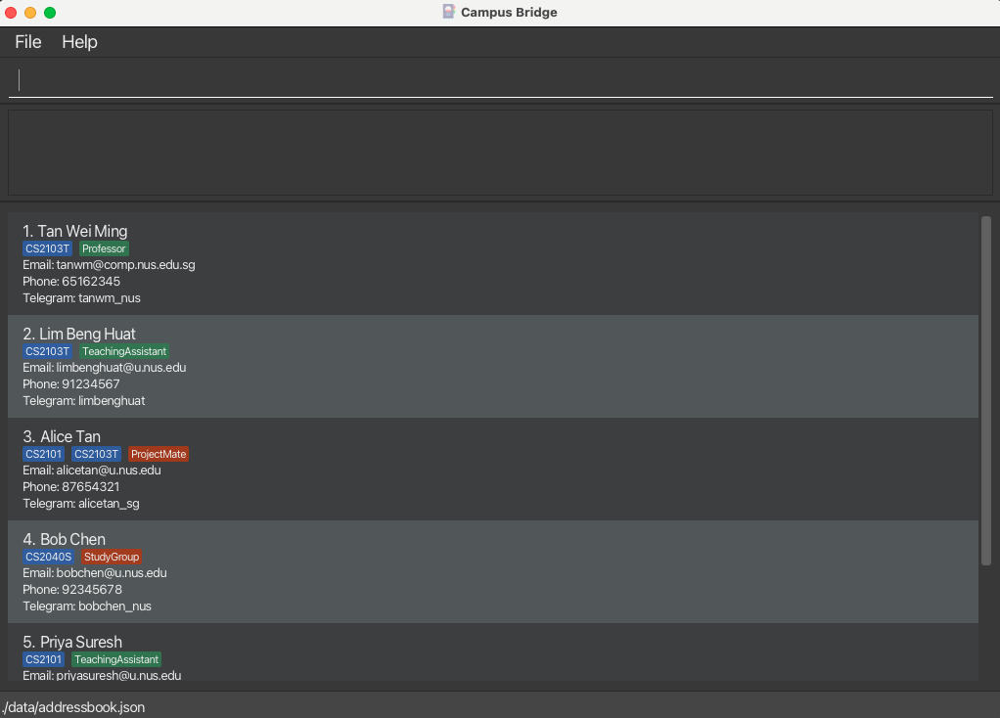
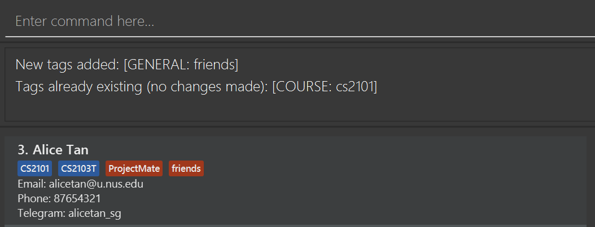
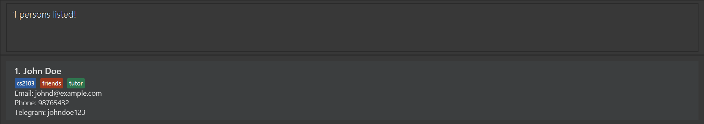
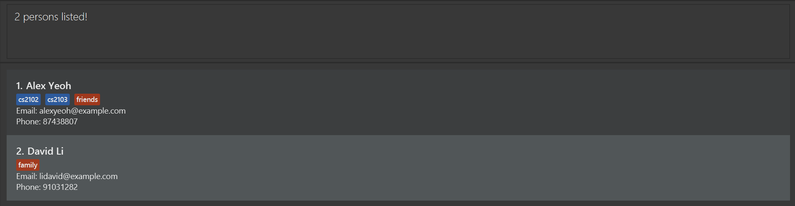

CampusBridge is a **desktop app for managing contacts, optimized for use via a Command Line Interface** (CLI) while still having the benefits of a Graphical User Interface (GUI). If you can type fast, CampusBridge can get your contact management tasks done faster than traditional GUI apps.

* Table of Contents
{:toc}

--------------------------------------------------------------------------------------------------------------------

## Quick start

1. Ensure you have Java `17` or above installed in your Computer.<br>
   **Mac users:** Ensure you have the precise JDK version prescribed [here](https://se-education.org/guides/tutorials/javaInstallationMac.html).

1. Download the latest `.jar` file from [here](https://github.com/AY2526S2-CS2103-F11-2/tp/releases).

1. Copy the file to the folder you want to use as the _home folder_ for your CampusBridge application.

1. Open a command terminal, `cd` into the folder you put the jar file in, and use the `java -jar CampusBridge-v1.5.jar` command to run the application.<br>
   A GUI similar to the below should appear in a few seconds. Note how the app contains some sample data.<br>
   

1. Type the command in the command box and press Enter to execute it. e.g. typing **`help`** and pressing Enter will open the user guide in the browser.<br>
   Some example commands you can try:

   * `list` : Lists all contacts.

   * `add n/John Doe e/johnd@example.com p/98765432 h/johndoe123` : Adds a contact named `John Doe` to the address book.

   * `tag 1 tg/friend` : Adds the general tag `friend` to the 1st contact shown in the current list.

   * `find n/John` : Finds all contacts whose names contain `John`.

   * `delete i/3` : Deletes the 3rd contact shown in the current list.

   * `clear` : Deletes all contacts.

   * `exit` : Exits the app.

1. Refer to the [Features](#features) below for details of each command.

--------------------------------------------------------------------------------------------------------------------

## Data entry specifications

### Tag types

CampusBridge supports three tag types, each displayed in a distinct colour:

| Tag type | Colour | Purpose | Example |
|----------|--------|---------|---------|
| **Role** | Green | Academic role of the contact | `Professor`, `TeachingAssistant` |
| **Course** | Blue | NUS course code associated with the contact | `CS2103T`, `CS2101` |
| **General** | Red | Any other label | `ProjectMate`, `StudyGroup` |

**Tag prefixes:**
* `tr/ROLE_TAG` — creates a Role tag
* `tc/COURSE_TAG` — creates a Course tag
* `tg/GENERAL_TAG` — creates a General tag

**Tag constraints:**
* Tags are **case-insensitive** — `tr/Friends`, `tr/FRIENDS` and `tr/friends` all refer to the same tag.
* Tag names must be **alphanumeric**.
    * Only letters A-Z, a-z, and number 0-9 are allowed.
    * Spaces and special characters (e.g `@`, `#`, `-`, `!`, `_`) are not allowed.
* Each tag name must be unique within its type — you cannot create two Role tags with the same name, but a Role tag and a General tag can share the same name.

### Email validation

Emails should be of the format `local-part@domain` and adhere to the following constraints:

**Local-part:**
* Should only contain alphanumeric characters and these special characters: `+`, `_`, `.`, `-`
* May not start or end with any special characters

**Domain:**
* Made up of one or more domain labels. If there is more than one domain label, they are separated by periods
* Must end with a domain label at least 2 characters long
* Each domain label must start and end with alphanumeric characters
* Each domain label must consist of alphanumeric characters, separated only by hyphens, if any

**Examples:**<br/>

| Email | Valid? | Reason |
|-------|--------|--------|
| `john.doe@example.com` | ✓ | Correct domain |
| `john+test@u.nus.edu` | ✓ | Correct domain |
| `.john@example.com` | ✗ | Starts with special character |
| `john@example.c` | ✗ | Domain label less than 2 characters |

**NUS domain check:**

CampusBridge is designed for NUS students and staff. When adding or editing a contact:

| Email domain            | Behavior                                   |
|-------------------------|--------------------------------------------|
| `@u.nus.edu` (student)  | No warning                                 |
| `@nus.edu.sg` (staff)   | No warning                                 |
| `@*.nus.edu.sg` (staff) | No warning                                 |
| Other domains           | Warning shown (but contact is still added) |

<div markdown="span" class="alert alert-warning">:exclamation: **Note:**
Non-NUS emails are still accepted, but a warning will be displayed to alert you that the email does not belong to an NUS domain.
</div>

## Features

<div markdown="block" class="alert alert-info">

**:information_source: Notes about the command format:**<br>

* Words in `UPPER_CASE` are the parameters to be supplied by the user.<br>
  e.g. in `add n/NAME`, `NAME` is a parameter which can be used as `add n/John Doe`.

* Items in square brackets are optional.<br>
  e.g `n/NAME [t/TAG]` can be used as `n/John Doe t/friend` or as `n/John Doe`.

* Items with `…`​ after them can be used multiple times including zero times.<br>
  e.g. `[t/TAG]…​` can be used as ` ` (i.e. 0 times), `t/friend`, `t/friend t/family` etc.

* Parameters can be in any order.<br>
  e.g. if the command specifies `n/NAME p/PHONE_NUMBER`, `p/PHONE_NUMBER n/NAME` is also acceptable.

* Commands that do not take parameters (such as `list`, `exit` and `clear`) will show an error if extra arguments are provided.<br>
  e.g. `list 123` will result in an error instead of being interpreted as `list`.

* Prefixes are case-insensitive.<br>
  e.g. n/NAME and N/NAME are treated the same way.

* If you are using a PDF version of this document, be careful when copying and pasting commands that span multiple lines as space characters surrounding line-breaks may be omitted when copied over to the application.
</div>

### Viewing help : `help`

Opens the user guide in the browser, and optionally directly to the section for a specific command.

**Format:** `help [COMMAND]`

Alternatively, press `F1` to open the user guide.

* `COMMAND` is optional. When provided, it must be a single valid command name (e.g. `add`, `edit`).
* If `COMMAND` is provided, the user guide is opened at the section for that command.
* If `COMMAND` is not a recognised command name, an error is shown listing all valid commands.
* If more than one word is provided (e.g. `help add clear`), an invalid command format error is shown.

Examples:
* `help` — opens the user guide in the browser.
* `help add` — opens the user guide at the **Adding a person** section.
* `help sort` — opens the user guide at the **Sorting persons** section.


### Adding a person : `add`

Adds a person to the address book.

**Format:** `add n/NAME e/EMAIL [p/PHONE_NUMBER] [h/TELEGRAM_HANDLE]`

* `n/NAME` and `e/EMAIL` are required.
* `p/PHONE_NUMBER` and `h/TELEGRAM_HANDLE` are optional.
* If no phone number is provided, the contact will be created without one.
* If no Telegram handle is provided, the contact will be created without one.
* Email must be unique. You cannot add two persons with the same email address.
* Telegram handle, if provided, must be unique. You cannot add two persons with the same Telegram handle.
* Telegram handles are treated case-insensitively for duplicate detection. For example, `handle1` and `HANDLE1` are considered the same handle.
* Repeated prefixes for single-valued fields are not allowed. For example, `add n/Amy n/Ben e/x@example.com` is invalid.
* Prefixes meant for other commands, such as `t/`, `tr/`, `tc/`, `tg/`, `i/`, `o/`, and `r/`, are invalid in an `add` command.

<div markdown="span" class="alert alert-primary">:bulb: **Tip:**
Parameters can be entered in any order, as long as each value is preceded by the correct prefix.
</div>

**Examples:**
* `add n/John Doe e/johnd@example.com`
* `add n/Betsy Crowe e/betsycrowe@example.com p/1234567`
* `add n/Alex Lim e/alexlim@example.com h/alex_lim123`
* `add e/berniceyu@example.com n/Bernice Yu p/98765432 h/bernice_yu`

### Editing a person : `edit`

Edits an existing person in the address book.

**Format:** `edit INDEX [n/NAME] [p/PHONE_NUMBER] [e/EMAIL] [h/TELEGRAM_HANDLE]`

* Edits the person at the specified `INDEX`.
* The index refers to the index number shown in the displayed person list.
* The index **must be a positive integer** 1, 2, 3, …​
* At least one of the optional fields must be provided.
* Existing values will be updated to the input values.
* The updated email and Telegram handle, if provided, must remain unique.
* Telegram handles are treated case-insensitively for duplicate detection. For example, `handle1` and `HANDLE1` are considered the same handle.

<div markdown="span" class="alert alert-info">:information_source: **Note:**
If the updated email is not an NUS domain (`@u.nus.edu` or `@*.nus.edu.sg` or `@nus.edu.sg`), a warning message will be shown. The contact will still be updated.
</div>

**Examples:**
*  `edit 1 p/91234567 e/johndoe@example.com`<br/>
Edits the phone number and email address of the 1st person to be `91234567` and `johndoe@example.com` respectively.
*  `edit 2 n/Betsy Crower h/betsyy`<br/>
Edits the name of the 2nd person to be `Betsy Crower` and the telegram handle to be `betsyy`.

### Deleting a person : `delete`

Deletes the specified person from the address book.

**Format:**
* `delete i/INDEX`
  * Deletes the person at the specified `INDEX`.
  * The index refers to the index number shown in the displayed person list.
  * The index **must be a positive integer** 1, 2, 3, …​

* `delete e/EMAIL`
  * Deletes the person with the specified `EMAIL`.
  * The email refers to the email address of a person shown in the displayed person list.
  * The email **must be a valid email address**.
  * Email matching is **case-insensitive**.

<div markdown="block" class="alert alert-info">:information_source: **NOTE:**
Only one of `i/INDEX` or `e/EMAIL` can be provided at a time.
</div>

**Examples:**
* Delete by index:
  * ```
    list
    delete i/2
    ```
    Deletes the 2nd person in the address book.
  * ```
    find n/Betsy
    delete i/1
    ```
    Deletes the 1st person in the results of the `find` command.
* Delete by email:
  * ```
    list
    delete e/betsy@example.com
    ```
    Deletes the person with email `betsy@example.com` in the address book.
  * ```
    find n/Betsy
    delete e/BETSY@example.com
    ```
    Deletes the person with email `BETSY@example.com` in the results of the `find` command (case-insensitive match also works).

### Tagging a person : `tag`

Adds one or more tags to an existing person in the address book.

**Format:** `tag INDEX [tr/ROLE_TAG]…​ [tc/COURSE_TAG]…​ [tg/GENERAL_TAG]…​`

* The index **must be a positive integer** 1, 2, 3, …​
* Tag names must be **alphanumeric** (no spaces or special characters).
* At least one of the optional fields must be provided.
* Each tag must have a value after its prefix (e.g. tg/ alone is not allowed).
* Multiple tags (of different or same types) can be added in a single command.
* Duplicate tags in the command will be ignored.

**Behavior:**
* Adds tags to the person at the specified `INDEX`.
* The index refers to the index number shown in the displayed person list.
* Existing tags will be preserved. New tags are appended.
* Tag matching is **case-insensitive**. (e.g. `friends` and `FRIENDS` are considered the same).
* If some tags already exist, only new ones are added. A message will show which tags were added and skipped.
* If all tags already exist, an error message will be shown and no changes will be made.

<div markdown="span" class="alert alert-primary">:bulb: **Tip:**
Obtain the index by using: `list` command to display all persons or `find` command to filter the persons.
</div>

**Examples:**
* `tag 1 tg/friends`<br/>
Adds the `friends` general tag to the 1st person in the displayed list.

* `tag 2 tr/tutor tc/cs2103 tg/helpful`<br/>
Adds the `tutor` role tag, `cs2103` course tag and `helpful` general tag to the 2nd person in the displayed list.

* `tag 3 tc/cs2101 tg/friends`<br/>
Adds the `friends` general tag to the 3rd person in the displayed list and shows `cs2101` course tag already exists.


### Untagging a person : `untag`

Removes one or more tags from an existing person in the address book.

**Format:** `untag INDEX [tr/ROLE_TAG]…​ [tc/COURSE_TAG]…​ [tg/GENERAL_TAG]…​`

* The index **must be a positive integer** 1, 2, 3, …​
* Tag names must be **alphanumeric** (no spaces or special characters).
* At least one of the optional fields must be provided.
* Each tag must have a value after its prefix (e.g. tg/ alone is not allowed).
* Multiple tags (of different or same types) can be removed in a single command.
* Duplicate tags in the command will be ignored.

**Behavior:**
* Removes the specified tags from the person at the given `INDEX`.
* The index refers to the index number shown in the displayed person list.
* Only tags currently assigned to the person will be removed.
* Existing tags that are not specified will remain unchanged.
* Tag matching is **case-insensitive**. e.g. `friends` and `FRIENDS` are considered the same.
* If some tags exist and others don't, the existing ones will be removed. A message will show which tags were not found.
* If none of the specified tags exist, an error message will be shown and no changes will be made.

<div markdown="span" class="alert alert-primary">:bulb: **Tip:**
Obtain the index by using: `list` command to display all persons or `find` command to filter the persons.
</div>

**Examples:**
* `untag 1 tg/friends`<br/>
Removes the `friends` general tag from the 1st person in the list.

* `untag 2 tr/tutor tc/cs2103 tg/classmates`<br/>
Removes the `tutor` role tag, `cs2103` course tag and `classmates` general tag from the 2nd person in the list.

* `untag 3 tc/cs2103 tc/cs2109`<br/>
Removes both `cs2103` and `cs2109` course tags from the 3rd person in the list.

### Clearing all tags of a specific type : `cleartag`

Clears all tags of a specific type from an existing person in the address book.

**Format:** `cleartag INDEX tr/ or cleartag INDEX tc/ or cleartag INDEX tg/`

* The index **must be a positive integer** 1, 2, 3, …​
* **Exactly one tag type prefix** must be provided (without any tag names).

**Behavior:**
* Clears all tags of the specified type from the person at the given `INDEX`.
* The index refers to the index number shown in the displayed person list.
* Only one tag type can be cleared at a time.
* Only tags of the specified type will be removed. Tags of other types remain unchanged.
* If the person has no tags of the specified type, an error message will be shown.

<div markdown="span" class="alert alert-primary">:bulb: **Tip:**
Obtain the index by using: `list` command to display all persons or `find` command to filter the persons.
</div>

**Examples:**
* `cleartag 1 tg/`<br/>
Clears all general tags from the 1st person in the displayed list.

* `cleartag 2 tr/`<br/>
Clears all role tags from the 2nd person in the displayed list.

### Listing all persons : `list`

Shows a list of all persons in the address book.

**Format:** `list`

Alternatively, press `F2` to list all contacts.

### Sorting persons : `sort`

Sorts the list of persons by the specified field.

**Format:** `sort o/ORDER [r/]`

* `ORDER` is case-insensitive. e.g. `NAME` is treated the same as `name`
* The `r/` flag is optional. When included, the sort order is reversed.
* `r/` cannot be used with `o/none`.

**Sort fields:**
* **`name`** — sorts persons alphabetically by name.
  e.g. `sort o/name` produces `Alice`, `Bob`, `Charlie`
* **`email`** — sorts persons alphabetically by email address.
  e.g. `sort o/email` produces `alice@example.com`, `bob@example.com`
* **`phone`** — sorts persons lexicographically by phone number. Persons without a phone number appear last.
  e.g. `sort o/phone` produces `81234567`, `91234567`, then persons with no phone
* **`none`** — resets the list to its default (insertion) order.

**Examples:**
* `sort o/name`<br/>
Sorts all persons alphabetically by name (A–Z).

* `sort o/name r/`<br/>
Sorts all persons in reverse alphabetical order by name (Z–A).

* `sort o/email`<br/>
Sorts all persons alphabetically by email address.

* `sort o/phone r/`<br/>
Sorts all persons in reverse lexicographic order by phone number.

* `sort o/none`<br/>
Resets the list to its default order.

### Locating persons by name/email/tag : `find`

Finds persons whose names, emails, or tags match the given keywords.

**Format:** `find [n/NAME [MORE_NAMES]] [e/EMAIL [MORE_EMAILS]] [t/TAG [MORE_TAGS]]`

* At least one of `n/`, `e/`, or `t/` must be present.
* The search is case-insensitive for all fields. e.g. `alex` will match `Alex`.
* The order of keywords does not matter. e.g. `Yeoh Alex` will match `Alex Yeoh`.
* Keywords consisting **only of special characters** are not allowed (e.g., `.`, `#`, `!@#`). If you provide such a keyword, an error message will be shown.
* Keywords containing both letters and special characters are valid (e.g., `"Dr."`, `"J."`), but special characters are ignored during name processing.

**Matching behavior:**
* **Name keywords** use both exact substring matching and fuzzy matching (typo-tolerant):
  * Exact match: `Jo` will match `John` and `Alice Johnson`.
  * Fuzzy match: `jon` will also match `John` (handles typos like missing or swapped letters).
  * The fuzzy matching threshold is calculated based on keyword length, allowing ~1 edit for short keywords and scaling up for longer keywords.
  * Special characters in names are ignored during processing. e.g. searching for `"Robert"` will match names like `"Robert-Smith"` or `"O'Robert"`.
* **Email keywords** use exact substring matching.
  e.g. `gmail` will match `john@gmail.com` and `alice.gmail@example.com`.
* **Tags** use exact matching.
  e.g. `cs2103` will match tag `cs2103` but not `cs210`.
* Multiple keywords within the same field are combined using **OR**.
  e.g. `n/Alex David` will match `Alex Yeoh` or `David Li`.
* Different fields are combined using **AND**.
  e.g. `n/Alex e/gmail` will match persons whose name matches `Alex` **and** email contains `gmail`.
* Repeated same-field prefixes are allowed.
  e.g. `find n/Alex n/David` behaves the same as `find n/Alex David`.
* Empty prefixes are not allowed.
  e.g. `find n/Alex e/` is invalid.

**Examples:**
* `find n/John`<br/>
Returns all persons whose names **match** `John` (with fuzzy matching support).

* `find n/jon`<br/>
Returns all persons whose names **match** `jon` (with fuzzy matching support).


* `find n/alice david`<br/>
Returns persons whose name **matches** `alice` **or** `david` (with fuzzy matching support).

* `find e/gmail`<br/>
Returns all persons whose emails **contain** `gmail`.

* `find t/friends`<br/>
Returns all persons tagged with `friends`.

* `find n/alex e/u.nus.edu`<br/>
Returns persons whose name **matches** `alex` **and** email **contains** `u.nus.edu`.

* `find n/alex t/friends`<br/>
Returns persons whose name **matches** `alex` **and** are tagged with `friends`.

* `find n/alex e/nus t/friends`<br/>
Returns persons whose name **matches** `alex` **and** email **contains** `nus` **and** are tagged with `friends`.

* `find n/alex david`<br/>
Returns persons whose name **matches** `alex` **or** `david`.


### Undoing the last action : `undo`

Reverts the most recent **undoable command** executed.

**Format:** `undo`

* Undoes the last executed command that supports undo.
* Multiple undo operations can be performed consecutively, up to the number of undoable commands previously executed.
* If there are no commands to undo, an error message will be shown.

**Undoable commands:**
```
add
delete
edit
clear
tag
untag
cleartag
```
Commands that are not listed above **cannot be undone**.

<div markdown="span" class="alert alert-primary">:bulb: **Tip:**
You can repeatedly use `undo` to step backwards through your previous changes.
</div>

**Examples:**
* ```
  add n/John Doe e/john@example.com
  undo
  ```
  Reverts the addition of John Doe.
* ```
  delete i/2
  undo
  ```
  Restores the previously deleted person.
* ```
  edit 1 n/Alex Tan
  undo
  ```
  Restores the original details of the 1st person.
* ```
  clear
  undo
  ```
  Restores all previously deleted contacts.
* ```
  undo
  ```
  When no more commands to undo, an error message will be shown indicating that there are no actions to undo.

### Navigating command history

Previously entered commands can be recalled using the keyboard.

* Press the **Up arrow** key to go back to an earlier command.
* Press the **Down arrow** key to go forward to a more recent command.

**Examples:**
* After running `add n/John Doe e/john@example.com`, press **Up** to recall it and modify it.
* After running several commands, press **Up** repeatedly to scroll back through them.

### Clearing all entries : `clear`

Clears all entries from the address book.

**Format:** `clear`

### Exiting the program : `exit`

Exits the program.

**Format:** `exit`

Alternatively, press `F3` to exit the application.

### Saving the data

CampusBridge data are saved in the hard disk automatically after any command that changes the data. There is no need to save manually.

### Editing the data file

CampusBridge data are saved automatically as a JSON file `[JAR file location]/data/addressbook.json`. Advanced users are welcome to update data directly by editing that data file.

<div markdown="span" class="alert alert-warning">:exclamation: **Caution:**
If your changes to the data file makes its format invalid, CampusBridge will discard all data and start with an empty data file at the next run. Hence, it is recommended to take a backup of the file before editing it.<br>
Furthermore, certain edits can cause CampusBridge to behave in unexpected ways (e.g., if a value entered is outside of the acceptable range). Therefore, edit the data file only if you are confident that you can update it correctly.
</div>

### Clearing all tags of multiple types [coming in v2.0]

_Details coming soon …_

--------------------------------------------------------------------------------------------------------------------

## FAQ

**Q**: How do I transfer my data to another Computer?<br>
**A**: Install the app in the other computer and overwrite the empty data file it creates with the file that contains the data of your previous CampusBridge home folder.

**Q**: What happens to my data when I upgrade from v1.3 to v1.4?<br>
**A**: CampusBridge v1.4 uses an updated storage format that may not be compatible with older versions. If your existing data cannot be read, the app will start with an empty data file. Back up your `data/addressbook.json` before upgrading.

--------------------------------------------------------------------------------------------------------------------

## Known issues

1. **When using multiple screens**, if you move the application to a secondary screen, and later switch to using only the primary screen, the GUI will open off-screen. The remedy is to delete the `preferences.json` file created by the application before running the application again.

--------------------------------------------------------------------------------------------------------------------

## Command summary

Action | Format, Examples
--------|------------------
**Add** | `add n/NAME e/EMAIL [p/PHONE_NUMBER] [h/TELEGRAM_HANDLE]` <br> e.g., `add n/James Ho e/jamesho@example.com p/22224444 h/james_ho`
**Clear** | `clear`
**Cleartag** | `cleartag INDEX tr/ or cleartag INDEX tc/ or cleartag INDEX tg/` <br> e.g., `cleartag 1 tg/`
**Delete** | `delete i/INDEX OR delete e/EMAIL`<br> e.g., `delete i/3 OR delete e/jameslee@example.com `
**Edit** | `edit INDEX [n/NAME] [p/PHONE_NUMBER] [e/EMAIL] [h/TELEGRAM_HANDLE]`<br> e.g.,`edit 2 n/James Lee e/jameslee@example.com h/jlee01`
**Exit** | `exit`
**Find** | `find [n/NAME [MORE_NAMES]] [e/EMAIL [MORE_EMAILS]] [t/TAG [MORE_TAGS]]`<br> e.g., `find n/alex e/gmail t/friends`
**Help** | `help [COMMAND]`<br> e.g., `help`, `help add`, `help sort`
**List** | `list`
**Sort** | `sort o/ORDER [r/]`<br> e.g., `sort o/name`, `sort o/email r/`, `sort o/none`
**Tag** | `tag INDEX [tr/ROLE_TAG]…​ [tc/COURSE_TAG]…​ [tg/GENERAL_TAG]…​`<br> e.g., `tag 1 tg/friends tc/cs2103`
**Untag** | `untag INDEX [tr/ROLE_TAG]…​ [tc/COURSE_TAG]…​ [tg/GENERAL_TAG]…​`<br> e.g., `untag 3 tr/tutor tc/cs2103`
**Undo** | `undo`

## Keyboard Shortcuts Summary

### Windows / Linux

Action | Shortcut
--------|----------
**Clear input box** | `Delete`
**Exit application** | `F3`
**Help** | `F1`
**List all contacts** | `F2`

---

### macOS

Action | Shortcut
--------|----------
**Clear input box** | `fn + Delete`
**Exit application** | `fn + F3`
**Help** | `fn + F1`
**List all contacts** | `fn + F2`
